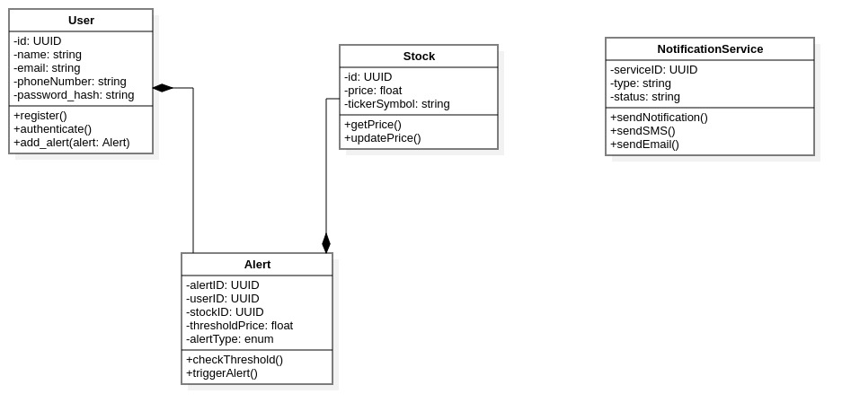
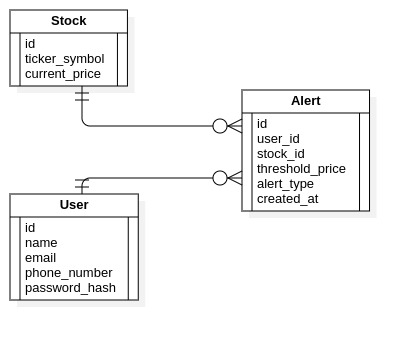

# Problem Statement

Real-time Stock Price Alert Service is a web based application designed to provide users with real-time tracking of stock prices and send alerts based on user-defined thresholds. 
The primary objective is to enable users to receive timely notifications (via email or SMS) when a stock's price crosses a specified threshold, aiding them in making informed financial decisions promptly.

The application will be containerized using Docker and deployed on Kubernetes. 

---

### **Components Overview**

1. Frontend:
Technology: ReactJS
- User authentication (sign up, log in)
- Set and manage stock price thresholds
- View real-time stock prices and alert history

2. Backend (API):
Technology: Python with Flask
- Handle user authentication and authorization
- Fetch real-time stock prices from third-party APIs (e.g., Alpha Vantage, Yahoo Finance)
- Manage user preferences and alert thresholds
- Trigger alerts when stock prices cross thresholds
- Interface with the Notification Service via a message queue

3. Notification Service:
Technology: Python
- Send notifications via to UI via Toastify

4. Database:
Technology: MariaDB
- Store user data, alert settings, and alert history
- Ensure efficient querying for alert triggering

5. Deployment:
Technology: Docker, AWS

---

# Class Diagram

---

# ER Diagram

---