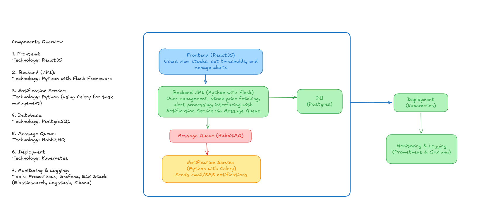

# Problem Statement

Real-time Stock Price Alert Service is a web based application designed to provide users with real-time tracking of stock prices and send alerts based on user-defined thresholds. 
The primary objective is to enable users to receive timely notifications (via email or SMS) when a stock's price crosses a specified threshold, aiding them in making informed financial decisions promptly.

The application will be containerized using Docker and deployed on Kubernetes. 

---

# Architecture

### **Components Overview**

1. Frontend:
Technology: ReactJS
- User authentication (sign up, log in)
- Set and manage stock price thresholds
- View real-time stock prices and alert history

2. Backend (API):
Technology: Python with Flask
- Handle user authentication and authorization
- Fetch real-time stock prices from third-party APIs (e.g., Alpha Vantage, Yahoo Finance)
- Manage user preferences and alert thresholds
- Trigger alerts when stock prices cross thresholds
- Interface with the Notification Service via a message queue

3. Notification Service:
Technology: Python (using Celery for task management)
- Consume alert messages from the message queue
- Send notifications via email (using SendGrid) or SMS (using Twilio)
- Handle retries and error logging for failed notifications

4. Database:
Technology: PostgreSQL
- Store user data, alert settings, and alert history
- Ensure efficient querying for alert triggering

5. Message Queue:
Technology: RabbitMQ
- Facilitate asynchronous communication between the Backend and Notification Service
- Ensure reliable message delivery and processing

6. Deployment:
Technology: Kubernetes
- Orchestrate containerized services
- Implement auto-scaling, load balancing, and health monitoring
- Manage secrets and configuration using Kubernetes Secrets and ConfigMaps

7. Monitoring & Logging:
Tools: Prometheus & Grafana
- Collect and visualize metrics
- Aggregate and analyze logs for troubleshooting and performance tuning

---

# Class Diagram

---

# ER Diagram

---