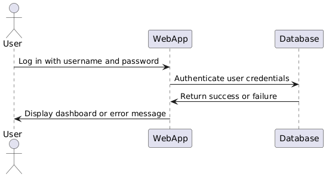

# Rubric and Documentation Contents

- [X] [Problem Statement](#problem-statement)
- [X] [Requirement Analysis](#requirements-analysis)
- [X] [Software Modeling](#software-modeling)
  - [X] [UML Diagram](#1-uml-diagram)
  - [X] [Sequence Diagram](#2-auth-login-sequence)
- [X] [ER Diagram](#er-diagram)
- [X] [Entities, DTOs, Repository, Service, Controller, Exception Handling](#backend)
- [X] [Security](#backend)
- [X] [Server-Side Rendering / Front-End Development](#front-end)
- [X] [Software Testing](#testing)
- [X] [Dockerization](#dockerization)
- [X] [CI/CD Pipeline](#cicd-pipeline)
- [X] [Software Deployment on Cloud](#software-deployment-on-cloud)
- [X] [Documentation](#rubric-and-documentation-contents)
- [X] Code Quality and Best Practices
- [X] [Video Presentation](#video-presentation)

# Problem Statement

Real-time Stock Price Alert Service is a web based application designed to provide users with real-time tracking of stock prices and send alerts based on user-defined thresholds. 
The primary objective is to enable users to receive timely notifications (via user interface) when a stock's price crosses a specified threshold.

---

# Requirements Analysis

1. Functional Requirements
   1. User Authentication:
      - Users can register with a unique username and password. 
      - Users can log in and log out securely. 
   2. User Stock Management
      - Users can add stocks to their watchlist with a defined threshold. 
      - Users can view all the stocks they have added to their watchlist. 
      - Users can remove stocks from their watchlist. 
   3. Stock Price Alert
      - System monitors stock prices and sends alerts when a stock crosses the user-defined threshold.
      - Alerts can be sent via email or displayed in the application.
   4. API Endpoints 
      - User Registration
        - User Login
        - Add Stock
        - View Stocks
        - Remove Stock

2. Non-Functional Requirements
   1. Scalability
      - The system should handle a growing number of users and stocks efficiently.
   2. Performance
      - Real-time or near real-time notification of stock price changes. 
   3. Security
      - Protect user data with encryption for sensitive fields like passwords. 
      - Secure API endpoints with token-based authentication (e.g., JWT).
   4. Reliability 
      - Ensure system uptime to provide consistent monitoring and alerting services. 
      - Handle API errors gracefully with proper status codes and messages.
   5. Usability 
      - Intuitive and easy-to-use user interface for stock management.
   6. Extensibility
      -Design the system to support additional features like portfolio tracking or integration with stock market APIs.

3. Technical Requirements
   1. Backend:
      - Framework: Flask (Python)
      - Database: MariaDB 
      - ORM: SQLAlchemy
   2. Frontend:
      - Library: ReactJS 
      - REST API Integration: Fetch API 
      - Notification Mechanism: React Toastify https://www.npmjs.com/package/react-toastify
   3. APIs:
      - Integration with third-party stock API - Finnhub https://finnhub.io/docs/api
   4. Testing:
      - Service layer tests
      - Controller layer tests
   5. CI/CD:
      - Automated testing using Github Actions
   6. Deployment:
      - Hosting: AWS 
      - Docker for containerization.

4. Use Case Analysis
   1. **Register a User**
      - Actor: New User 
      - Goal: To create an account for tracking stock alerts.
   2. Login
      - Actor: Registered User 
      - Goal: To authenticate and access the system.
   3. Add a Stock
      - Actor: Authenticated User 
      - Goal: To add a stock and define a price threshold.
   4. Remove a Stock 
      - Actor: Authenticated User 
      - Goal: To stop tracking a stock.
   5. Receive Alert
      - Actor: System 
      - Goal: Notify the user when a stock price crosses the threshold.
5. Constraints
   1. Stock Data Source 
      - Limited to free APIs for stock price data in initial phases.
   2. Notification Frequency 
      - Limit alerts to avoid spamming users.
   3. Storage
      - Restrict the number of stocks a user can monitor in free-tier usage.
   4. Technology Stack
      - Must use the selected frameworks and tools as specified for implementation.

---

# Software Modeling

### 1. UML Diagram


### 2. Auth Login Sequence



### 3. Stock Sequence


---

# ER Diagram


---

# Backend

1. Models
2. Service
3. Controllers
4. Routes
5. DB Config
6. Exceptions Handling 
7. Testing
   1. Service layer
   2. Controller layer
8. Security: Login, Registration, Reading jwt token

---

# Front-end

https://github.com/ilmedova/asd-project-ui

---

# Testing

To run the test first ensure you have installed python, pip and python-venv module

1. Enable virtual environment. Run the following in project root folder

```shell
python -m venv env
```

```shell
source env/bin/activate
```

2. Install requirements

```shell
pip install -r requirements.txt
```

3. Run the tests
```shell
pytest
```

All test should be running successfully as shown in the screenshot


---

# Dockerization

Both back-end and front-end are dockerized

---

# CI/CD Pipeline

Implemented Github Actions for running the test automatically everytime any updates being pushed to main branch

---

# Software Deployment on Cloud

Deployed both back-end and front-end to AWS EC2 instance.
Demo can be accessed using the link: http://3.145.91.198/

---

# Video Presentation

Video Presentation Link:

https://drive.google.com/file/d/1zVbTDK-IehaN_YTo6XQ8HMz6GzbKRuTr/view?usp=sharing
